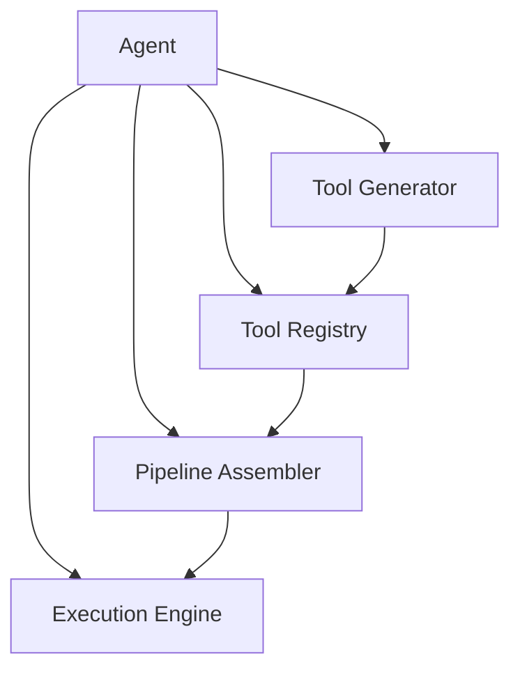
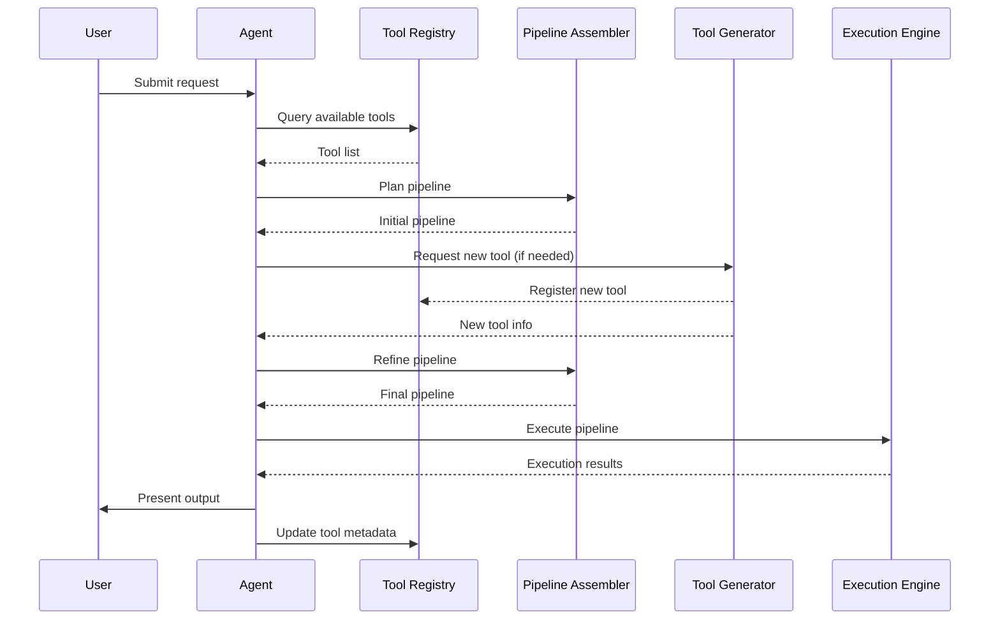
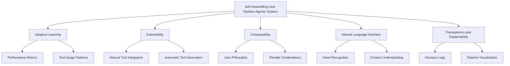
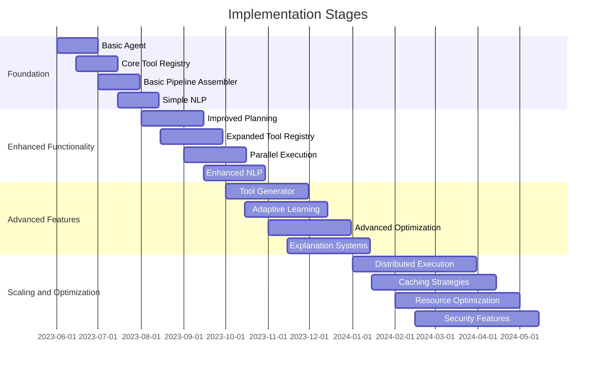
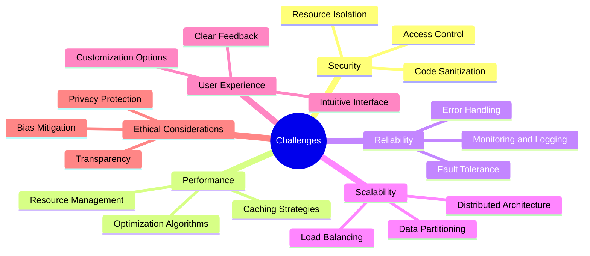
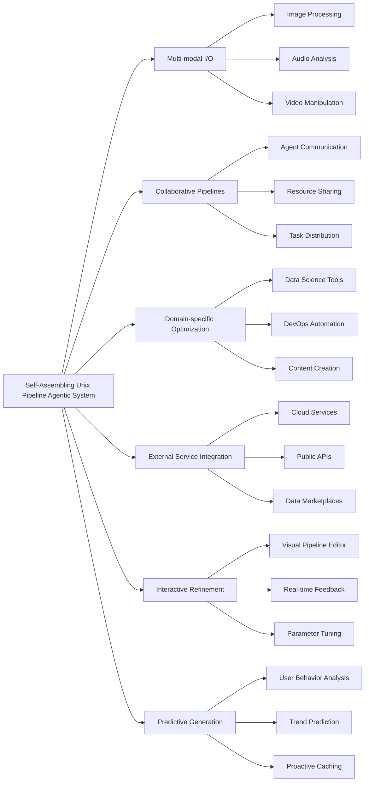
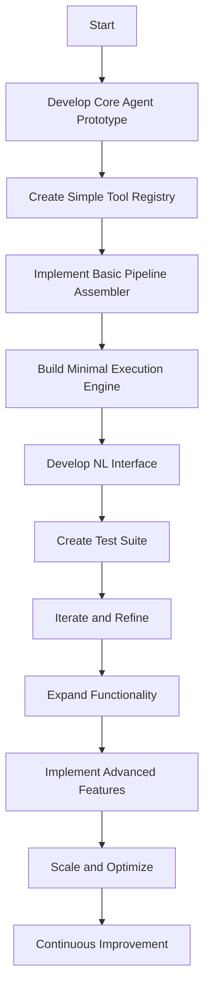

Certainly! I'll create a high-level markdown document that outlines a plan for writing a self-assembling unix pipeline agentic system. I'll include increasingly detailed Mermaid diagrams to illustrate the system's architecture and workflow.

# Self-Assembling Unix Pipeline Agentic System

## 1. Overview

The Self-Assembling Unix Pipeline Agentic System is a framework that combines the power of Unix-style command-line tools with artificial intelligence to create dynamic, adaptive pipelines for various tasks. This system will leverage existing tools and generate new ones as needed, assembling them into efficient workflows.

## 2. Core Components

### 2.1 Agent

The central intelligence that interprets user requests, plans pipelines, and manages the overall workflow.

### 2.2 Tool Registry

A database of available tools, their capabilities, inputs, and outputs.

### 2.3 Pipeline Assembler

Constructs pipelines by combining tools based on the agent's instructions.

### 2.4 Execution Engine

Runs the assembled pipeline and manages data flow between tools.

### 2.5 Tool Generator

Creates new tools when existing ones are insufficient for a task.

## 3. Detailed Workflow

### 3.1 User Input Processing

1. Parse natural language input
2. Extract key tasks and requirements
3. Formulate a high-level plan

### 3.2 Pipeline Planning

1. Query Tool Registry for relevant tools
2. Identify gaps in tool capabilities
3. Request new tool generation if needed
4. Design optimal pipeline structure

### 3.3 Pipeline Assembly

1. Select specific tool instances
2. Configure tool parameters
3. Define data flow between tools
4. Optimize for parallelism and resource usage

### 3.4 Execution

1. Initialize tools and allocate resources
2. Manage data streaming between tools
3. Monitor progress and handle errors
4. Collect and aggregate results

### 3.5 Feedback and Improvement

1. Analyze pipeline performance
2. Update Tool Registry with new insights
3. Refine tool generation heuristics
4. Adapt agent's planning strategies

## 4. Key Features

### 4.1 Adaptive Learning

The system continuously improves its performance by learning from each execution, updating tool metadata, and refining its planning strategies.

### 4.2 Extensibility

New tools can be easily integrated into the system, either manually or through automatic generation, expanding the system's capabilities over time.

### 4.3 Composability

The Unix philosophy of small, focused tools is maintained, allowing for flexible and powerful combinations to solve complex problems.

### 4.4 Natural Language Interface

Users can interact with the system using natural language, making it accessible to both technical and non-technical users.

### 4.5 Transparency and Explainability

The system provides insights into its decision-making process, allowing users to understand and trust the generated pipelines.

## 5. Implementation Stages

### 5.1 Foundation (MVP)

1. Implement basic Agent with simple planning capabilities
2. Create Tool Registry with a set of core Unix tools
3. Develop basic Pipeline Assembler and Execution Engine
4. Implement simple natural language processing for user inputs

### 5.2 Enhanced Functionality

1. Improve Agent's planning algorithms
2. Expand Tool Registry with more advanced tools
3. Implement parallel execution in the Execution Engine
4. Enhance natural language understanding and context retention

### 5.3 Advanced Features

1. Develop Tool Generator for creating new tools
2. Implement adaptive learning mechanisms
3. Create advanced pipeline optimization techniques
4. Develop comprehensive logging and explanation systems

### 5.4 Scaling and Optimization

1. Implement distributed execution for large-scale pipelines
2. Develop caching and memoization strategies
3. Optimize resource allocation and scheduling
4. Implement advanced security and access control features

## 6. Challenges and Considerations

### 6.1 Security

Ensure that the system doesn't execute malicious code or access unauthorized resources.

### 6.2 Performance

Balance the flexibility of dynamic pipeline assembly with the need for efficient execution.

### 6.3 Reliability

Implement robust error handling and recovery mechanisms to ensure pipeline stability.

### 6.4 Scalability

Design the system to handle increasing complexity of tasks and growing tool ecosystems.

### 6.5 User Experience

Strike a balance between power and simplicity in the natural language interface.

### 6.6 Ethical Considerations

Address potential biases in tool selection and pipeline generation, ensuring fair and ethical use of the system.

## 7. Future Enhancements

### 7.1 Multi-modal Input and Output

Extend the system to handle various input types (e.g., images, audio) and generate diverse output formats.

### 7.2 Collaborative Pipelines

Enable multiple agents to collaborate on complex tasks, distributing work and sharing resources.

### 7.3 Domain-specific Optimization

Develop specialized planning strategies and tool sets for specific domains (e.g., data science, DevOps, content creation).

### 7.4 Integration with External Services

Connect the system with cloud services, APIs, and external data sources to expand its capabilities.

### 7.5 Interactive Pipeline Refinement

Implement a system for users to interactively refine and customize generated pipelines.

### 7.6 Predictive Pipeline Generation

Develop capabilities to anticipate user needs and proactively suggest or prepare pipelines.

## 8. Conclusion

The Self-Assembling Unix Pipeline Agentic System represents a powerful fusion of traditional Unix philosophy with cutting-edge AI capabilities. By dynamically assembling pipelines from a growing set of tools, the system can adapt to a wide range of tasks and user needs.

Key benefits of this approach include:

1. Flexibility: Easily adaptable to new tasks and domains
2. Efficiency: Optimal use of existing tools and resources
3. Scalability: Ability to handle increasingly complex problems
4. Accessibility: Natural language interface for diverse user groups
5. Continuous Improvement: Learning and evolving with each use

As the system evolves, it has the potential to revolutionize how we approach complex computational tasks, making powerful data processing and analysis capabilities accessible to a broader audience.

## 9. Next Steps

To begin implementing this system, consider the following initial steps:

1. Develop a prototype of the core Agent with basic planning capabilities
2. Create a simple Tool Registry with a selection of common Unix tools
3. Implement a basic Pipeline Assembler that can connect tools in a linear fashion
4. Build a minimal Execution Engine that can run simple pipelines
5. Develop a rudimentary natural language interface for user input
6. Create a test suite with a variety of simple tasks to validate the system's functionality

